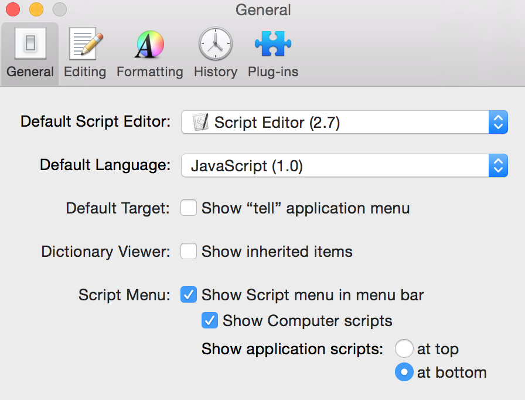

# AppleScript (JXA) Applications

This is the content of the ~/Libary/Scripts/Applications on my Yosemite machine.

## What's in here?

Not much yet, but sometimes I find myself writing [JXA](https://github.com/dtinth/JXA-Cookbook "JXA Cookbook") as I need to do improve my workflow, but that means I need to keep the JXA in Sync between my Laptop and Desktop. I hate keeping things in Sync, so instead I will be putting it here.

If you think you want to use these tools, fork this repo and put it into /Users/yourname/Library/Scripts/Applications, then launch Script Editor once and enable the Script menu (rockin' it old school!).

Then you can use these scripts in your workflows, services, etc.

## But really, what's in here?

Right now not much, mostly just the beginnings of a project to synchronize the views between my Evernote (which I use for reference material) and my Things (which I use as a to-do manager) apps if the project has the same name.

If you can think of other things, I'd love a pull request. If possible, I'd like to keep this JXA wherever possible - I just find it much easier to write and re-write.

